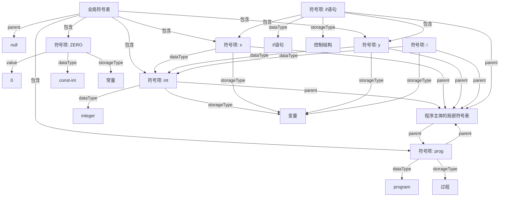

# 中期检查

## 中期检查

<Pagination classNames="text-gray-300" />

---
layout: index
indexEntries:
  - { title: "", uri: 3 }
  - { title: "符号表逻辑结构", uri: 6 }
---

# 目录

---
layout: default
---

# 当下进度

TBDTBDTBD


---
layout: figure
figureCaption: Curated cover image for Slidev
figureFootnoteNumber: 1
figureUrl: https://source.unsplash.com/collection/94734566/1920x1080
---

# 词法，语法分析

---
layout: figure-side
figureCaption: Curated cover image for Slidev
figureFootnoteNumber: 1
figureUrl: https://source.unsplash.com/collection/94734566/1024x768
---

# 符号表设计

- Ensures figures are displayed nicely out of the box
- Allows placing the figure on the left or right
- Features an optional figure caption

<Footnotes separator>
  <Footnote :number=1><a href="https://unsplash.com/collections/94734566/slidev" rel="noreferrer" target="_blank">Anthony Fu</a></Footnote>
</Footnotes>

---
layout: full
---


# <span style="line-height: 2;">符号表逻辑结构</span>

<div class="grid grid-cols-2 gap-x-4"><div>

#### <span style="line-height: 2;">变量</span>

```cpp
std::map<std::string,std::shared_ptr<Symbol>>
localSymbols;

std::map<std::string,std::shared_ptr<Symbol>>
globalSymbols;
```


<div v-click>

- 上述结构通过 C++ 的 map 定义了全局变量和局部变量
- 符号名字作为 map 中的 key，指向符号实体的指针作为 value

</div>

</div><div>

#### <span style="line-height: 2;">别名</span>

```cpp
std::map<std::string,std::shared_ptr<TypeNode>>
localAliases;

std::map<std::string,std::shared_ptr<TypeNode>>
globalAliases;
```

<div v-click>

- 该逻辑结构与传统的符号表类似，方便程序通过键值对的方式访问符号实体
- 采用了分层和分类的方式来组织和管理不同作用域和符号信息，使编译器更加高效和精确

</div>
</div></div>

---
layout: default
---

# <span style="line-height: 3;">符号表物理结构</span>


<div class="grid grid-cols-2 gap-x-4"><div>

```cpp
struct TypeNode;//省略了 TypeNode 的代码
struct Symbol{
    std::string name; //符号名称
    bool isConst;
    llvm::Value * ptr;
    std::shared_ptr<TypeNode> typeNode;
    /**省略其他代码**/
};
```

<div v-click>

- 局部变量和全局变量的信息都封装在 Symbol 类中
- 局部别名和全局别名的信息被封装在 TypeNode 类中


</div>

</div><div>


<div v-click>

- 在 Symbol 类中，存储了符号的名字、是否为常量、指向变量的 LLVM 值指针、指向类型节点的指针等信息，这些信息都被封装在该结构体中
- 符号表的物理结构采用了面向对象的特征，将不同的符号信息封装在不同的类中，提高了代码的可读性和可维护性


</div>
</div></div>

---
layout: default
---

# 语义分析

---
layout: default
---

# 代码生成


---
layout: center
class: "text-center"
---

# Footnotes & Footnote

<span class="font-extralight">
  <q>Give credit where credit is due</q>
  <sup>1</sup>
</span>

<Footnotes separator>
  <Footnote :number=1>Smart person</Footnote>
</Footnotes>

---
layout: default
class: "text-center"
---

# Pagination

<div class="grid grid-cols-3 gap-10 pt-4 -mb-6">



</div>


<p class="absolute font-extralight right-14 transform rotate-8 top-4">Here!</p>

---
layout: index
indexEntries:
  - { title: "GitHub", uri: "https://github.com/alexanderdavide/slidev-theme-academic" }
  - { title: "npm", uri: "https://www.npmjs.com/package/slidev-theme-academic" }
  - { title: "Slidev", uri: "https://sli.dev" }
indexRedirectType: external
---

# index

`index` used as a list of references
